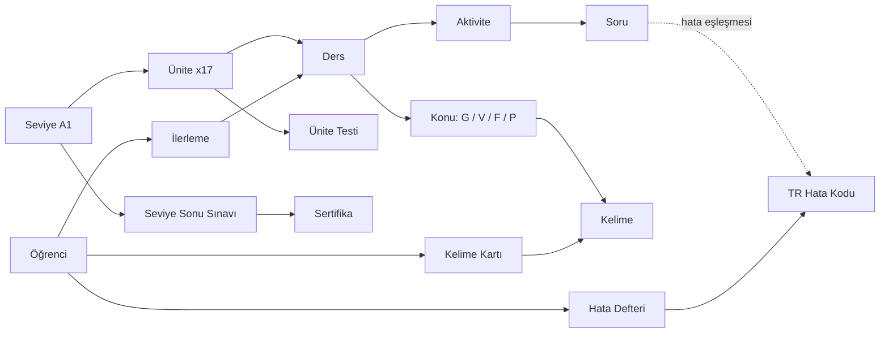
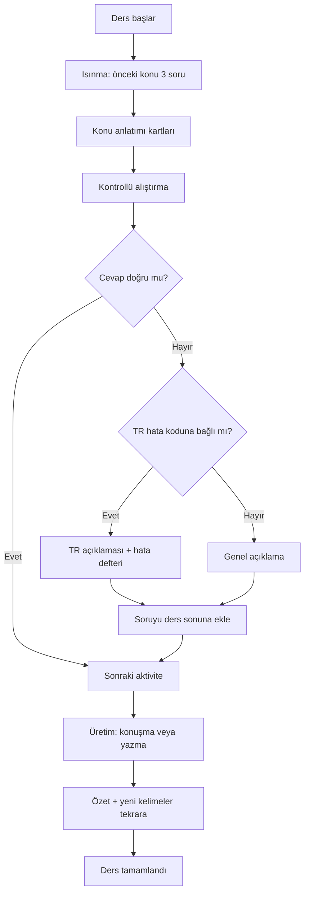
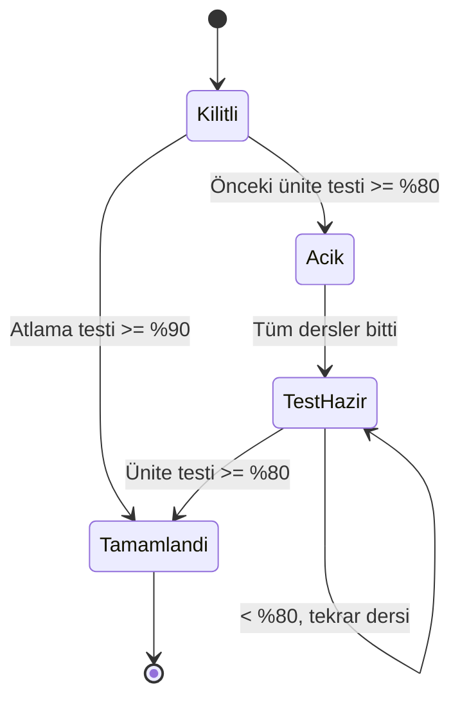
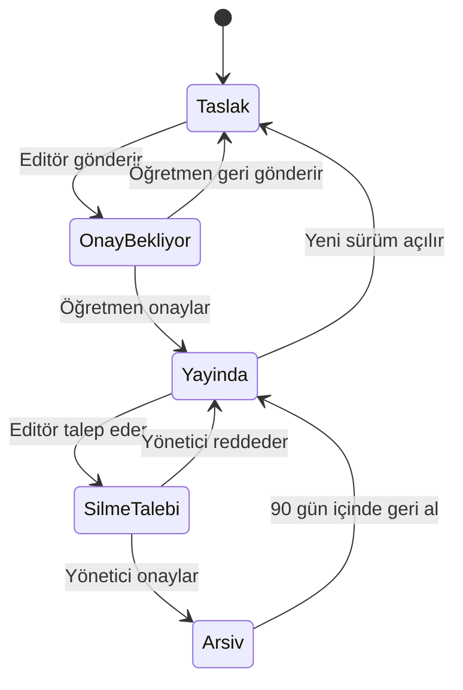
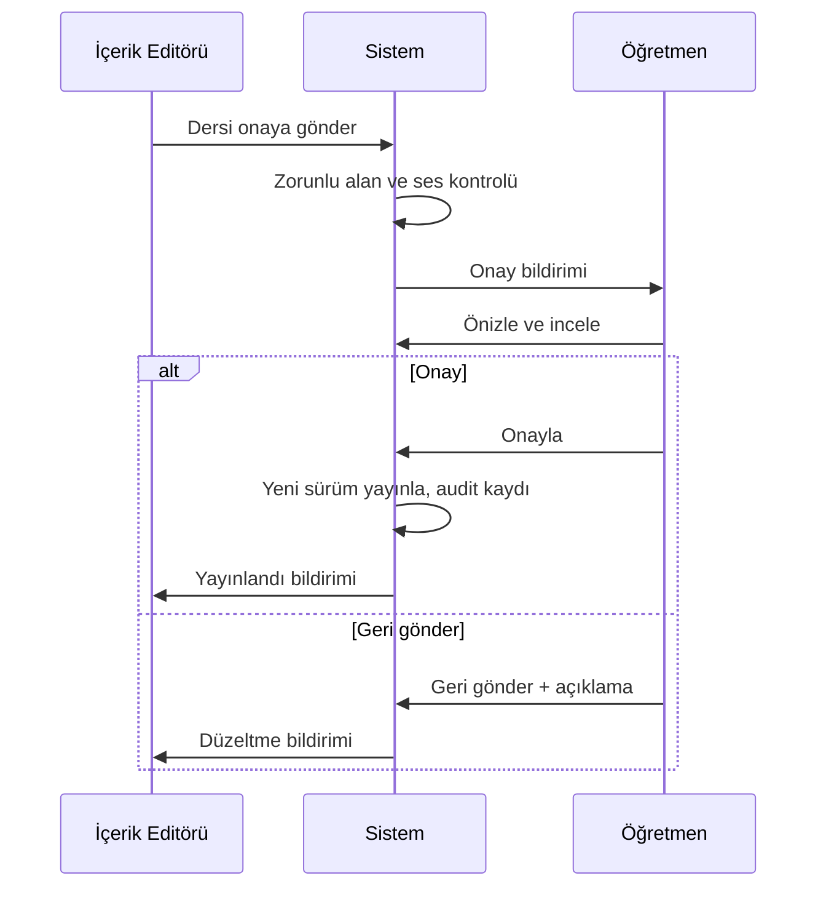
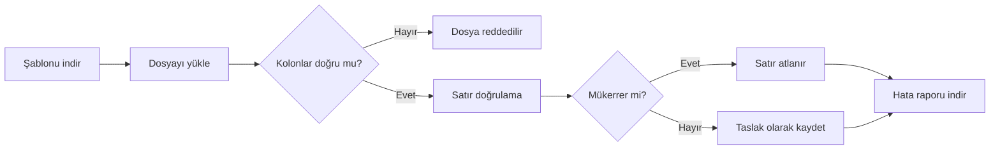

# A1 Seviye İngilizce Modülü — İş Analizi Dokümanı

Oct 9, 2026 · @Hakan

## 1. Doküman Bilgisi ve Kapsam

Bu doküman, A1 seviyesini bitiren kullanıcının CEFR A1 tanımını tam karşılamasını sağlayacak mobil öğrenme modülünü tanımlar.

| Özellik | Değer |
| --- | --- |
| Sürüm | 0.1 Taslak |
| Hedef okuyucu | Mobil geliştirici, backend geliştirici, içerik editörü, test ekibi |
| Modül | A1 Seviye İngilizce (Başlangıç) |
| Faz / Teslim | Faz 1 — A1 seviyesi uçtan uca |
| Onaylayacak | Ürün sahibi (Hakan) |

**Kapsam dahil:** 17 ünitelik A1 müfredatı, 30 gramer konusu (G01–G30), 22 kelime teması (\~735 kelime), 12 iletişim becerisi (F01–F12), 8 telaffuz konusu (P01–P08), 10 Türk öğrenci hatası (TR01–TR10), konu anlatım kartları, 12 aktivite tipi, aralıklı tekrarlı kelime kartları, konuşma ve telaffuz kontrolü, ünite sonu testleri, A1 seviye sonu sınavı ve sertifikası, ilerleme takibi, hata defteri, bildirim ve günlük hedef, içerik yönetim paneli.

**İçerik eki:** Konu anlatımları, örnek cümleler, alıştırmalar ve kelime listeleri ayrı dokümanda verilir: *A1 İçerik Kılavuzu* (kısaltma ICK). Bu doküman o içeriğin uygulamada nasıl sunulacağını tanımlar.

**Kaynak dokümanlar**

| Kısaltma | Doküman | Kullanılan bölüm |
| --- | --- | --- |
| XLS-G | A1\_Kapsam.xlsx — Gramer | 30 konu, örnekler, "A1+ köprü" notları |
| XLS-V | A1\_Kapsam.xlsx — Kelime Temaları | 22 tema, yaklaşık kelime sayıları, "tahmindir" notu |
| XLS-F | A1\_Kapsam.xlsx — İletişim | 12 beceri |
| XLS-P | A1\_Kapsam.xlsx — Telaffuz | 8 konu ve örnekleri |
| XLS-TR | A1\_Kapsam.xlsx — TR Hataları | 10 hata, yanlış/doğru örnekleri |
| PRJ | Proje tanımı "İngilizce Çalışma" | Bireysel öğrenciye yol haritası, mobil uygulama |
| CEFR | Avrupa Ortak Dil Çerçevesi A1 tanımı (öğretmen bilgisi) | A1 "yapabilir" ifadeleri, dört beceri |

## 2. İş Bağlamı

Türk yetişkin öğrenciler çoğu uygulamada kelime ezberler ama A1 sonunda kendini tanıtamaz, saat soramaz ve "I hungry", "He work" gibi Türkçeden gelen hataları sürdürür. Mevcut uygulamalar konuyu Türkçe mantıkla açıklamaz, konuşmayı ölçmez ve "A1 bitti" demek için somut kanıt sunmaz.

Uygulama bu sorunu üç şeyle çözer: Türkçe karşılaştırmalı konu anlatımı, her konuda hedefli Türk öğrenci hatası çalışması ve dört beceriyi (dinleme, okuma, konuşma, yazma) ölçen seviye sonu sınavı.

**Hedefler**

1. A1'i tamamlayan kullanıcı, XLS dosyasındaki 30 gramer konusunun her birinde ünite testinde en az %80 doğru yapar.
2. Kullanıcı, 735 hedef kelimenin en az %85'ini (\~625) aralıklı tekrarda "öğrenildi" durumuna taşır.
3. Kullanıcı, 12 iletişim becerisinin her birini en az bir konuşma görevinde başarıyla tamamlar.
4. 10 Türk öğrenci hatasının her biri, seviye sonu sınavında %80 ve üzeri doğrulukla üretilir.
5. Günlük 20 dakikalık çalışmayla A1 seviyesi 12–16 haftada bitirilebilir (toplam \~70–90 saat).

**A1 tamamlama tanımı (başarı ölçütleri)**

Kullanıcıya "A1 Tamamlandı" rozeti ve sertifikası, aşağıdaki dört koşulun hepsi sağlanınca verilir.

| Koşul | Ölçüt | Kanıt |
| --- | --- | --- |
| Üniteler | 17 ünitenin tümü tamamlandı, her ünite testi ≥ %80 | İlerleme ekranında 17/17 |
| Kelime | 735 kelimenin ≥ %85'i "öğrenildi" (art arda 3 doğru, son tekrar aralığı ≥ 7 gün) | Kelime istatistiği |
| Seviye sonu sınavı | Toplam ≥ %70; her beceri bölümü ≥ %60 | Sınav sonuç raporu |
| Konuşma | 12 iletişim görevinin 12'si tamamlandı; telaffuz puanı ortalaması ≥ 70/100 | Konuşma görevleri listesi |

Bu koşullar CEFR A1 "yapabilir" tanımlarına şöyle karşılık gelir: tanıdık ifadeleri ve çok basit cümleleri anlar ve kullanır; kendini ve başkasını tanıtır; nerede yaşadığı, tanıdığı kişiler ve sahip olduğu şeyler hakkında soru sorar ve cevaplar; karşısındaki yavaş ve net konuşursa basit biçimde iletişim kurar; kişisel bilgi formu doldurur ve kısa kartpostal yazar.

## 3. Aktörler

Modülde beş aktör vardır; içeriği öğrenci tüketir, editör üretir, öğretmen onaylar.

| Aktör | Tanım | Bu modülde yaptığı |
| --- | --- | --- |
| Öğrenci | Uygulamayı kullanan yetişkin, ana dili Türkçe | Seviye testi çözer, dersleri bitirir, kelime tekrarı yapar, konuşma görevlerini kaydeder, sınava girer, sertifika alır |
| İçerik Editörü | Ders ve soru içeriğini sisteme giren kişi | Konu anlatımı, örnek, soru, ses dosyası ekler; içeriği onaya gönderir |
| Öğretmen (İçerik Onaylayıcı) | Pedagojik doğruluktan sorumlu kişi | Editör içeriğini onaylar veya geri gönderir; sınav sorularını onaylar |
| Sistem Yöneticisi | Platform ve kullanıcı yönetiminden sorumlu kişi | Rol atar, tanım listelerini yönetir, silme taleplerini onaylar |
| Sistem (otomatik) | Uygulamanın arka plan işlemleri | Ders kilidi açar, tekrar zamanı hesaplar, telaffuz puanı üretir, hata defterine yazar, bildirim gönderir, sertifika üretir |

İleride öğrenciye konuşma pratiği yaptıracak bir **Yapay Zekâ Eğitmen** aktörü eklenebilir (S-05).

## 4. Kavramsal Model ve İş Kuralları

Seviye ünitelere, ünite derslere, ders aktivitelere bölünür; her ders XLS'teki bir veya daha fazla konu koduna bağlanır.

Öğrencinin tüm durumu üç kayıtta tutulur: ders ilerlemesi, kelime kartı (aralıklı tekrar) ve hata defteri.

### 4.1 İş kuralları

| Kod | Kural | Kaynak |
| --- | --- | --- |
| BR-01 | A1 seviyesi 17 üniteden oluşur ve üniteler sırayla açılır. | Analiz kararı (Bölüm 8) |
| BR-02 | Bir ünite, önceki ünitenin testinden ≥ %80 alınca açılır. | Analiz kararı |
| BR-03 | Ünite atlama testinden ≥ %90 alan kullanıcı için ünite tamamlandı sayılır; kelimeleri yine tekrar listesine eklenir. | Analiz kararı |
| BR-04 | 30 gramer konusunun her biri en az bir derste anlatılır ve en az bir ünite testinde ölçülür. | XLS-G |
| BR-05 | "A1+ köprü" notlu konular (G28, G29, G30) son ünitede verilir ve seviye sonu sınavının en fazla %10'unu oluşturur. | XLS-G not kolonu, S-01 |
| BR-06 | Her ders şu sırayla ilerler: ısınma, konu anlatımı, kontrollü alıştırma, üretim (konuşma veya yazma), özet. | Analiz kararı (öğretmen bilgisi: PPP yöntemi) |
| BR-07 | Bir ders 8–12 dakikada bitecek şekilde en fazla 15 aktivite içerir. | Analiz kararı |
| BR-08 | Her konu anlatımı bir Türkçe karşılaştırma notu içerir; ilgili TR hata kodu varsa o hatanın kartı gösterilir. | XLS-TR, analiz kararı |
| BR-09 | Bir soru seçeneği bir TR hata koduna bağlanabilir; kullanıcı o seçeneği seçerse hata defterine o kodla yazılır ve hataya özel açıklama gösterilir. | XLS-TR |
| BR-10 | Kelime kartı durumları Yeni, Öğreniliyor, Öğrenildi'dir; tekrar aralıkları 1, 3, 7, 14, 30 gündür; yanlış cevap aralığı 1 güne dürür. | Analiz kararı |
| BR-11 | Kelime, art arda 3 doğru cevap ve ≥ 7 günlük aralıkla "Öğrenildi" olur. | Analiz kararı |
| BR-12 | Tema başına kelime sayıları tahmindir; kesin liste içerik editörü tarafından yayınlanır, toplam 735 ± %10 olmalıdır. | XLS-V alt not |
| BR-13 | Günlük yeni kelime limiti varsayılan 10'dur; kullanıcı 5–20 arasında değiştirebilir. | Analiz kararı |
| BR-14 | Kelime kartı dil bilgisi etiketlerini taşır: sayılabilir/sayılamaz, düzensiz çoğul, fiilin -s, -ing ve düzenli geçmiş biçimi. | XLS-G G07, G10, G13, G19, G29 |
| BR-15 | Ünite testi en az 20 sorudan oluşur ve ünitenin her konu kodundan en az 2 soru içerir. | Analiz kararı |
| BR-16 | Her soru havuzu testteki soru sayısının en az 2 katıdır; tekrar denemede aynı soru seti gelmez. | Analiz kararı |
| BR-17 | Seviye sonu sınavı 17 ünite bitince açılır; geçme koşulu toplam ≥ %70 ve her bölüm ≥ %60'tır. | Analiz kararı (Bölüm 2) |
| BR-18 | Seviye sonu sınavını geçemeyen kullanıcı 72 saat sonra farklı bir formla yeniden girer. | Analiz kararı |
| BR-19 | Konuşma görevi telaffuz puanı ≥ 70/100 olunca başarılı sayılır; başarısızlık ünite ilerlemesini engellemez ama sertifikayı engeller. | Analiz kararı |
| BR-20 | Mikrofon izni yoksa konuşma görevi atlanabilir ve "eksik" olarak işaretlenir. | Analiz kararı |
| BR-21 | Her İngilizce örnek cümlenin ses kaydı ve Türkçe çevirisi vardır. | Analiz kararı, S-02 |
| BR-22 | Kullanıcı Konu Kütüphanesi'nden her konunun anlatımını okuyabilir; testi ancak ünite kilidi açılınca çözebilir. | Analiz kararı |
| BR-23 | İçerik onaylanmadan yayına çıkmaz; içeriği giren editör kendi içeriğini onaylayamaz. | Analiz kararı |
| BR-24 | Yayındaki içerik değişince yeni sürüm oluşur; kullanıcının eski cevapları eski sürüme bağlı kalır. | Analiz kararı |
| BR-25 | İçerik doğrudan silinmez: talep ve gerekçe, yönetici onayı (talep eden onaylayamaz), arşiv, 90 gün geri alma. Kullanıcı cevabı olan içerik yalnız arşivlenir. | Analiz kararı |
| BR-26 | Aktivite tipi, tema, beceri ve seviye değerleri koda gömülü değil, tanım listesinden yönetilir. | Analiz kararı |
| BR-27 | Seviye testi sonucu başlangıç ünitesini önerir; kullanıcı öneriyi kabul etmeden baştan başlayabilir. | Analiz kararı |

## 5. Kullanıcı Hikâyeleri ve Kabul Kriterleri

Faz 1 için 26 hikâye vardır: 17'si zorunlu (M), 7'si hedef (S), 2'si sonra (C). Öncelik: M = bu faz zorunlu, S = hedef, C = sonra olabilir.

### US-01 Seviye testi ve başlangıç (M)

**Öğrenci olarak**, ilk açılışta kısa bir seviye testi çözmek istiyorum, **böylece** bildiğim konuları tekrar etmek zorunda kalmayım.

- Test en fazla 25 sorudan oluşur ve 10 dakikayı geçmez.
- Sonuç ekranı önerilen başlangıç ünitesini ve zayıf konu kodlarını gösterir.
- "Baştan başla" seçeneği her zaman vardır (BR-27).
- Testi atlayan kullanıcı Ünite 1'den başlar.

### US-02 Ünite haritası ve kilitler (M)

**Öğrenci olarak**, ünitelerimi sırayla bir harita üzerinde görmek istiyorum, **böylece** nerede olduğumu ve neyin kaldığını bileyim.

- 17 ünite üç durumda gösterilir: Kilitli, Açık, Tamamlandı.
- Kilitli üniteye dokununca "Ünite N testinden %80 al" mesajı çıkar (BR-02).
- Her ünite kartı tamamlanan ders sayısını "3/5" biçiminde gösterir.

### US-03 Konu anlatımı (M)

**Öğrenci olarak**, gramer konusunu Türkçe açıklama, formül ve sesli örneklerle öğrenmek istiyorum, **böylece** kuralı ezberlemeden anlayayım.

- Anlatım en fazla 6 karttan oluşur: kural, formül tablosu, örnekler, Türkçe karşılaştırma, dikkat (TR hatası), mini kontrol.
- Her örnek cümlede çal butonu ve Türkçe çeviri vardır; çeviri dokununca açılır.
- Konunun XLS kodu (ör. A1-G13) editör ekranında görünür, öğrencide görünmez.

### US-04 Alıştırma aktiviteleri (M)

**Öğrenci olarak**, öğrendiğim kuralı farklı alıştırma tipleriyle uygulamak istiyorum, **böylece** kuralı kullanabilir hale geleyim.

- 12 aktivite tipi desteklenir (Bölüm 7.4).
- Her cevaptan sonra ≤ 300 ms içinde doğru/yanlış ve tek cümlelik açıklama gösterilir.
- Yanlış cevaplanan soru ders sonunda bir kez daha sorulur.
- Cümle kurma aktivitesinde kelime sırası yanlışsa yanlış konumdaki kelimeler kırmızı işaretlenir.

### US-05 Türk öğrenci hatası geri bildirimi ve hata defteri (M)

**Öğrenci olarak**, Türkçeden kaynaklanan hatamı yaptığımda nedenini görmek istiyorum, **böylece** aynı hatayı tekrarlamayım.

- TR koduna bağlı seçenek seçildiğinde "Türkçede ... ama İngilizcede ..." kalıbında açıklama çıkar (BR-09).
- Hata defteri her TR kodu için yapılan hata sayısını ve son 10 denemedeki doğruluk yüzdesini gösterir.
- Bir kodda 3 hata birikince 5 soruluk "Hata Tamiri" mini dersi önerilir.

### US-06 Kelime öğrenme ve aralıklı tekrar (M)

**Öğrenci olarak**, ünitenin kelimelerini resim, ses ve örnek cümleyle öğrenip zamanında tekrar etmek istiyorum, **böylece** kelimeleri unutmayım.

- Günlük tekrar kuyruğu, zamanı gelen kartlar ve günlük yeni kelime limitinden oluşur (BR-10, BR-13).
- Kart ön yüzü İngilizce kelime ve ses, arka yüzü Türkçe anlam, örnek cümle ve dil bilgisi etiketi gösterir (BR-14).
- Kelime istatistiği Yeni / Öğreniliyor / Öğrenildi sayılarını 735 hedefine göre gösterir.

### US-07 Konuşma görevi (M)

**Öğrenci olarak**, iletişim becerilerini (F01–F12) sesli cümlelerle denemek istiyorum, **böylece** gerçek hayatta konuşabileyim.

- Kullanıcı cümleyi söyler; sistem 0–100 arası telaffuz puanı ve yanlış söylenen kelimeleri işaretler.
- Puan ≥ 70 ise görev başarılı olur (BR-19).
- Mikrofon izni yoksa "Atla" görünür ve görev "eksik" işaretlenir (BR-20).

### US-08 Diyalog ve dinleme (M)

**Öğrenci olarak**, her iletişim becerisini gerçekçi bir diyalogda dinlemek istiyorum, **böylece** ana dili İngilizce olan birini anlayabileyim.

- Her F kodu için en az bir diyalog vardır; ses normal ve 0.75x hızda çalınabilir.
- Altyazı üç modda gösterilir: kapalı, İngilizce, İngilizce + Türkçe.
- Diyaloktan sonra en az 3 anlama sorusu sorulur.

### US-09 Telaffuz dersleri (M)

**Öğrenci olarak**, Türkçede olmayan sesleri (th, w/v, uzun-kısa ünlüler) ayrı çalışmak istiyorum, **böylece** anlaşılır konuşayım.

- P01–P08 konularının her biri bir telaffuz dersiyle karşılanır.
- Minimal çift aktivitesinde (ship/sheep) kullanıcı duyduğu kelimeyi seçer; en az 10 çift sorulur.
- -s takası dersinde kullanıcı kelimeyi /s/, /z/, /ɪz/ gruplarına ayırır.

### US-10 Yazma görevi (S)

**Öğrenci olarak**, kısa metinler yazmak istiyorum, **böylece** form doldurup basit mesaj yazabileyim.

- Her ünitede bir yazma görevi vardır (ör. kişisel bilgi formu, 30–50 kelimelik kartpostal).
- Sistem görevin hedef yapılarını kontrol eder (ör. en az 3 Present Simple cümlesi) ve eksik olanı listeler.
- Kelime sayısı alt sınırın altındaysa gönder butonu pasiftir.

### US-11 Ünite testi (M)

**Öğrenci olarak**, üniteyi bitirdiğimi kanıtlamak istiyorum, **böylece** bir sonraki üniteye geçeyim.

- Test ≥ 20 sorudur, her konu kodundan ≥ 2 soru içerir (BR-15).
- Sonuç konu kodu bazında doğruluk gösterir; %80 altı konular için tekrar dersi önerilir.
- Tekrar denemede farklı soru seti gelir (BR-16).

### US-12 Ünite atlama testi (S)

**Öğrenci olarak**, bildiğim bir üniteyi testle geçmek istiyorum, **böylece** zaman kaybetmeyeyim.

- Kilitli ünitede "Testle geç" seçeneği vardır; geçme notu %90'dır (BR-03).
- Geçilen ünitenin kelimeleri tekrar kuyruğuna "Öğreniliyor" olarak eklenir.

### US-13 Seviye sonu sınavı (M)

**Öğrenci olarak**, A1 seviyesini dört beceriyi ölçen bir sınavla bitirmek istiyorum, **böylece** gerçekten A1 olduğumu bileyim.

- Sınav 5 bölümdür: Dil Kullanımı (30 soru), Dinleme (15), Okuma (15), Yazma (2 görev), Konuşma (4 görev); toplam süre ≤ 60 dk.
- Geçme: toplam ≥ %70, her bölüm ≥ %60 (BR-17).
- Kalan kullanıcıya zayıf bölümler ve 72 saat sonraki tarih gösterilir (BR-18).

### US-14 A1 sertifikası (M)

**Öğrenci olarak**, A1'i bitirince paylaşılabilir bir sertifika almak istiyorum, **böylece** başarımı gösterebileyim.

- Sertifika yalnız Bölüm 2'deki dört koşul sağlanınca üretilir.
- Sertifikada ad soyad, tarih, bölüm puanları ve doğrulama kodu bulunur; PDF olarak indirilir.

### US-15 İlerleme ve istatistik (M)

**Öğrenci olarak**, A1'in yüzde kaçını bitirdiğimi görmek istiyorum, **böylece** motivasyonumu koruyayım.

- Ana ekranda A1 ilerleme yüzdesi dört koşulun ağırlıklı ortalaması olarak gösterilir (ünite %40, kelime %25, sınav %25, konuşma %10).
- Beceri radarı gramer, kelime, dinleme, okuma, konuşma, yazma puanlarını gösterir.

### US-16 Günlük hedef, seri ve bildirim (S)

**Öğrenci olarak**, günlük hedef koyup hatırlatılmak istiyorum, **böylece** düzenli çalışayım.

- Hedef seçenekleri: 10, 20, 30 dakika; varsayılan 20.
- Kullanıcı bildirim saatini seçer; hedef tamamlanmışsa o gün bildirim gitmez.
- Seri (streak) art arda hedefin tutulduğu gün sayısıdır; haftada 1 "dondurma" hakkı vardır.

### US-17 Konu kütüphanesi ve arama (S)

**Öğrenci olarak**, herhangi bir konunun anlatımına hızlıca dönmek istiyorum, **böylece** unuttuğum kuralı tekrar okuyayım.

- Kütüphane Gramer, Kelime, İletişim, Telaffuz, Sık Hatalar sekmelerinden oluşur.
- İngilizce veya Türkçe arama (ör. "have got", "çoğul") ≤ 1 sn'de sonuç verir.

### US-18 Çevrimdışı kullanım (C)

**Öğrenci olarak**, internet yokken ders çalışmak istiyorum, **böylece** yolda da ilerleyeyim.

- İndirilen ünite ses dahil cihazda tutulur; konuşma puanlama çevrimdışı çalışmaz.
- Bağlantı gelince cevaplar ≤ 30 sn içinde senkronlanır.

### US-19 İçerik oluşturma (M)

**İçerik editörü olarak**, ders, aktivite ve soru oluşturmak istiyorum, **böylece** müfredatı uygulamaya taşıyayım.

- Her ders en az bir XLS konu koduna bağlanmadan kaydedilemez.
- Yeni içerik "Taslak" durumunda oluşur; önizleme mobil görünümde açılır.
- Aynı ünitede aynı başlıklı ders varsa uyarı verilir.

### US-20 İçerik onayı (M)

**Öğretmen olarak**, editörün hazırladığı içeriği yayına almadan önce incelemek istiyorum, **böylece** yanlış İngilizce yayınlanmasın.

- Öğretmen "Onayla" veya "Geri gönder" seçer; geri gönderirken açıklama zorunludur.
- Editör kendi içeriğini onaylayamaz (BR-23).

### US-21 Excel ile toplu içerik yükleme (M)

**İçerik editörü olarak**, kelime listelerini ve soruları Excel'den yüklemek istiyorum, **böylece** 735 kelimeyi tek tek girmeyeyim.

- Sistem şablonu indirir; yüklemede satır bazında hata raporu verir (ör. "Satır 14: tema kodu yok").
- Aynı kelime + aynı anlam varsa satır atlanır ve raporda "mükerrer" yazılır.
- 5.000 satır ≤ 60 sn'de işlenir; yüklenen içerik "Taslak" olur.

### US-22 İçerik dışa aktarma (S)

**İçerik editörü olarak**, müfredatı Excel'e aktarmak istiyorum, **böylece** öğretmenle dışarıda gözden geçirelim.

- Export filtrelenmiş listeyi içerir ve kim, ne zaman bilgisiyle kayıt altına alınır.
- Export dosyası import şablonuyla aynı kolonlara sahiptir; düzenlenip geri yüklenebilir.

### US-23 İçerik silme talebi ve geri alma (S)

**İçerik editörü olarak**, hatalı içeriği kaldırmak istiyorum, **böylece** öğrenciler yanlış içerik görmesin.

- Silme talebi gerekçe ister ve yönetici onayına düşer (BR-25).
- Onaylanan içerik 90 gün boyunca "Geri al" ile döndürülebilir.

### US-24 Değişiklik geçmişi (S)

**Öğretmen olarak**, bir dersin kim tarafından ne zaman değiştirildiğini görmek istiyorum, **böylece** hatanın kaynağını bulayım.

- Geçmiş; kullanıcı, zaman, alan, eski ve yeni değeri listeler ve düzenlenemez.
- Herhangi bir sürüm "Bu sürüme dön" ile yeni taslak olarak açılabilir; dönüş de onaya tabidir.

### US-25 Hesap ve verilerin silinmesi (M)

**Öğrenci olarak**, hesabımı ve kayıtlarımı silmek istiyorum, **böylece** kişisel verim kalmasın.

- Silme talebi uygulama içinden yapılır; 30 gün içinde ses kayıtları dahil tüm kişisel veri silinir.
- Kullanıcıya talep ve tamamlanma bildirimi e-posta ile gider.

### US-26 Yapay zekâ eğitmenle serbest konuşma (C)

**Öğrenci olarak**, A1 kelime ve gramerle sınırlı bir yapay zekâ eğitmenle sohbet etmek istiyorum, **böylece** güvenli bir ortamda pratik yapayım.

- Eğitmen yalnız kullanıcının açtığı ünitelerin yapılarını kullanır.
- TR hata kodlarına uyan hataları sohbet sonunda listeler ve hata defterine yazar (S-05).

## 6. Süreç Akışları

Beş akış tanımlanır: ders tamamlama, ünite ve seviye ilerlemesi, içerik durumları, içerik onayı ve Excel ile toplu yükleme.

### 6.1 Ders tamamlama akışı

Yanlış cevaplanan sorular ders sonunda bir kez daha sorulur; ikinci yanlış ders tamamlanmasını engellemez ama ünite testine ağırlık olarak yansır.

### 6.2 Ünite ve seviye ilerlemesi

Son ünite (Ü17) tamamlanınca seviye sonu sınavı açılır. Sertifika için sınav, kelime ve konuşma koşullarının hepsi gerekir (Bölüm 2).

### 6.3 İçerik kaydı durumları

Yayındaki bir sürüm, yeni sürüm onaylanana kadar öğrencide görünmeye devam eder (BR-24).

### 6.4 İçerik onayı

Ses kaydı eksik örnek cümle varsa ders onaya gönderilemez (BR-21).

### 6.5 Excel ile toplu yükleme

Yükleme tüm satırlar için tek işlem kaydı açar; yönetici bu işlemi tek seferde geri alabilir.

## 7. Ekran Tanımları

Modülde 7 öğrenci ekranı ve 6 içerik yönetimi formu vardır. Kısaltmalar: Z = zorunlu, K = koşullu, O = otomatik/salt okunur, – = isteğe bağlı.

### 7.1 Profil ve başlangıç (öğrenci)

| Alan | Tip | Z | Kural |
| --- | --- | --- | --- |
| Ad | Metin (50) | Z | Sertifikada kullanılır |
| Soyad | Metin (50) | Z | Sertifikada kullanılır |
| E-posta | E-posta | Z | Tekil; giriş ve bildirim için |
| Öğrenme amacı | Seçim | – | İş, Seyahat, Sınav, Kişisel gelişim, Çocuğuma yardım |
| Günlük hedef | Seçim | Z | 10, 20, 30 dk; varsayılan 20 |
| Bildirim saati | Saat | – | Boşsa bildirim gitmez |
| Aksan tercihi | Seçim | Z | Amerikan, İngiliz; varsayılan S-02'ye göre |
| Günlük yeni kelime | Tam sayı | Z | 5–20, varsayılan 10 (BR-13) |
| Seviye testi sonucu | Metin | O | Önerilen ünite ve puan |
| Mikrofon izni | Onay kutusu | O | Cihazdan okunur |

### 7.2 Ana sayfa ve ünite haritası

**Bileşenler:** A1 ilerleme yüzdesi · günlük hedef halkası · seri sayısı · "Devam et" butonu (son kalınan ders) · bugün tekrar edilecek kelime sayısı · 17 ünite kartı.

**Ünite kartı:** ünite no ve adı · durum (Kilitli / Açık / Tamamlandı) · ders ilerlemesi "3/5" · ünite testi puanı · "Testle geç" (kilitliyse).

### 7.3 Ders oynatıcı

**Bileşenler:** üst ilerleme çubuğu · aktivite alanı · "Kontrol et" butonu · geri bildirim paneli (doğru/yanlış, açıklama, TR hata kartı) · ses hızı (1x / 0.75x) · çıkış (ilerleme kaydedilir).

**Konu anlatımı kart türleri:** Kural · Formül tablosu · Örnekler (ses + çeviri) · Türkçe karşılaştırma · Dikkat (TR hatası) · Mini kontrol.

### 7.4 Aktivite tipleri

| Kod | Aktivite | Ölçtüğü | Cevap kontrolü |
| --- | --- | --- | --- |
| AT-01 | Çoktan seçmeli | Gramer, kelime | Tek doğru seçenek |
| AT-02 | Boşluk doldurma (yazarak) | Gramer, yazım | Kabul edilen cevaplar listesi; büyük/küçük harf ve kısaltma (I'm = I am) eşit sayılır |
| AT-03 | Boşluk doldurma (seçerek) | Gramer | Tek doğru |
| AT-04 | Cümle kurma (kelime sıralama) | Kelime sırası (G26, TR07) | Kabul edilen sıralar listesi |
| AT-05 | Eşleştirme | Kelime, zamir, zıt sıfat | Tüm çiftler doğru |
| AT-06 | Dinle ve seç | Dinleme, kelime | Tek doğru |
| AT-07 | Dikte (dinle ve yaz) | Dinleme, yazım | Kabul edilen cevaplar; noktalama yok sayılır |
| AT-08 | Sesli tekrar | Telaffuz | Telaffuz puanı ≥ 70 |
| AT-09 | Minimal çift | Telaffuz (P03–P05) | Tek doğru |
| AT-10 | Diyalog rol yapma | İletişim (F kodları) | Her replik için puan ≥ 70 |
| AT-11 | Hata bulma ve düzeltme | TR hataları | Hatalı kelime seçimi + düzeltme |
| AT-12 | Resim / kelime kartı | Kelime | Doğru/yanlış + tekrar algoritması |

### 7.5 Kelime tekrarı

**Bileşenler:** kalan kart sayısı · kart (ön: kelime + ses + resim; arka: anlam, örnek cümle, etiket) · "Bildim / Bilemedim" · tema filtresi · istatistik (Yeni / Öğreniliyor / Öğrenildi, hedef 735).

### 7.6 Hata defteri

**Liste kolonları:** TR kodu · hata adı · yanlış/doğru örneği · hata sayısı · son 10 denemede doğruluk · "Hata Tamiri" butonu.

### 7.7 Sınav ekranı (ünite testi, atlama testi, seviye sonu sınavı)

**Bileşenler:** bölüm adı · soru sayısı "12/30" · kalan süre (yalnız seviye sonu sınavında) · soruyu işaretle · bölüm sonu özet. Sınav sırasında geri bildirim gösterilmez; sonuç ekranında konu ve beceri bazında puan gösterilir.

### 7.8 İlerleme ve sertifika

**Bileşenler:** A1 yüzdesi ve dört koşulun durumu · beceri radarı (6 eksen) · haftalık çalışma süresi · öğrenilen kelime sayısı · sertifika (PDF indir, doğrulama kodu).

### 7.9 Ders formu (içerik yönetimi)

**Kimlik**

| Alan | Tip | Z | Kural |
| --- | --- | --- | --- |
| Ders kodu | Metin | O | Ünite ve sıra numarasından üretilir (ör. U08-L03) |
| Ders adı (TR) | Metin (100) | Z | Aynı ünitede tekil |
| Ders adı (EN) | Metin (100) | Z |  |
| Ünite | Ünite seçimi | Z | 17 üniteden biri |
| Sıra | Tam sayı | Z | Ünite içinde tekil |
| Ders tipi | Seçim | Z | Gramer, Kelime, İletişim, Telaffuz, Tekrar, Yazma |
| Konu kodları | Çoklu seçim | Z | XLS kodları (G, V, F, P, TR); en az 1 |
| Tahmini süre | Tam sayı (dk) | Z | 8–12 (BR-07) |

**Takip**

| Alan | Tip | Z | Kural |
| --- | --- | --- | --- |
| Durum | Seçim | O | Taslak, Onay Bekliyor, Yayında, Silme Talebi, Arşiv |
| Sürüm | Tam sayı | O | Her yayında +1 |
| Oluşturan / Onaylayan | Kullanıcı | O | Aynı kişi olamaz (BR-23) |

**Liste kolonları:** Ders kodu · ad · ünite · tip · konu kodları · durum · sürüm · son güncelleme. **Detay sekmeleri:** Genel · Konu anlatımı · Aktiviteler · Önizleme · Geçmiş.

### 7.10 Konu anlatımı formu

| Alan | Tip | Z | Kural |
| --- | --- | --- | --- |
| Konu kodu | Seçim | Z | G01–G30, P01–P08 |
| Kural (TR) | Zengin metin (1.000) | Z | En fazla 3 paragraf |
| Formül tablosu | Alt tablo | K | Gramer konularında zorunlu (olumlu, olumsuz, soru, kısa cevap) |
| Örnek cümleler (çoklu satır) | Alt tablo: EN, TR, ses | Z | En az 5; her birinde ses zorunlu (BR-21) |
| Türkçe karşılaştırma | Metin (500) | Z |  |
| İlgili TR hataları | Çoklu seçim | – | TR01–TR10 |
| Mini kontrol soruları | Soru seçimi | Z | 2–3 soru |

### 7.11 Soru formu

| Alan | Tip | Z | Kural |
| --- | --- | --- | --- |
| Aktivite tipi | Seçim | Z | AT-01–AT-12 |
| Soru metni / yönerge | Metin (300) | Z |  |
| Ses | Ses dosyası | K | AT-06, AT-07, AT-09'da zorunlu |
| Görsel | Görsel | K | AT-12'de zorunlu |
| Seçenekler (çoklu satır) | Alt tablo: metin, doğru mu, TR kodu, açıklama | K | Seçmeli tiplerde 2–4 seçenek, tek doğru |
| Kabul edilen cevaplar (çoklu satır) | Metin | K | Yazma tiplerinde en az 1 |
| Konu kodu | Seçim | Z | Ölçtüğü tek konu |
| Zorluk | Seçim | Z | 1 Kolay, 2 Orta, 3 Zor |
| Kullanım yeri | Çoklu seçim | Z | Ders, Ünite testi, Atlama testi, Seviye testi, Seviye sonu sınavı |

### 7.12 Kelime formu

| Alan | Tip | Z | Kural |
| --- | --- | --- | --- |
| Kelime / kalıp | Metin (60) | Z | Aynı kelime + aynı anlam tekil |
| Türkçe anlam | Metin (100) | Z |  |
| Kelime türü | Seçim | Z | isim, fiil, sıfat, zarf, zamir, edat, bağlaç, sayı, kalıp |
| Tema | Seçim | Z | V01–V22 |
| Ünite | Ünite seçimi | Z | İlk geçtiği ünite |
| Sayılabilirlik | Seçim | K | İsimde zorunlu: sayılabilir, sayılamaz |
| Çoğul biçimi | Metin | K | Düzensiz çoğullarda zorunlu (man → men) |
| Fiil biçimleri | Alt tablo: -s, -ing, geçmiş | K | Fiilde zorunlu (BR-14) |
| Okunuş (IPA) | Metin | – |  |
| Ses | Ses dosyası | Z | Seçili aksanlarda |
| Örnek cümle (EN / TR) | Metin | Z | Yalnız A1 yapıları kullanılır |
| Görsel | Görsel | – | Somut isimlerde önerilir |

### 7.13 Diyalog formu

| Alan | Tip | Z | Kural |
| --- | --- | --- | --- |
| İletişim kodu | Seçim | Z | F01–F12 |
| Başlık ve sahne | Metin (150) | Z | Ör. "Kafede sipariş" |
| Replikler (çoklu satır) | Alt tablo: konuşmacı, EN, TR, ses | Z | 4–12 replik |
| Anahtar kalıplar | Metin listesi | Z | 3–6 kalıp |
| Anlama soruları | Soru seçimi | Z | En az 3 (US-08) |

### 7.14 Konuşma ve yazma görevi formu

| Alan | Tip | Z | Kural |
| --- | --- | --- | --- |
| Görev tipi | Seçim | Z | Sesli tekrar, Rol yapma, Yazma |
| Yönerge (TR) | Metin (300) | Z |  |
| Hedef cümleler / model cevap | Metin listesi | Z |  |
| Hedef yapılar | Çoklu seçim | K | Yazmada zorunlu; G kodları |
| Kelime sınırı | Tam sayı aralığı | K | Yazmada zorunlu (ör. 30–50) |
| Geçme puanı | Tam sayı | Z | Varsayılan 70 |

## 8. A1 Müfredatı: Ünite Planı ve Kapsam Eşleşmesi

XLS'teki 82 kodun tamamı 17 üniteye dağıtıldı; kelime sayılarının toplamı XLS hedefi olan 735'e eşittir. Sıralama, her yapının bir öncekinin üzerine kurulmasına göre yapıldı: önce to be, sonra isim grubu, sonra Present Simple, en son Present Continuous ve geçmiş zamana köprü.

Her ünite yaklaşık 5 ders + 1 ünite testinden oluşur (toplam \~85 ders, \~17 test). Ders dağılımı: 2 gramer, 1 kelime, 1 iletişim/diyalog, 1 telaffuz + yazma.

| Ünite | Gramer | Kelime (≈ adet) | İletişim | Telaffuz | TR hatası | Üretim görevi |
| --- | --- | --- | --- | --- | --- | --- |
| Ü1 Hello! | G01, G02 (olumlu) | V01, V02 0–20, V22 (51) | F01, F02 | P01, P07 | TR01 | Kendini 3 cümleyle tanıt (konuşma) |
| Ü2 Where are you from? | G02 (olumsuz, soru, kısa cevap), G16 | V18, V02 30–100, V22 (43) | F02 | P08 | TR01 | Kişisel bilgi formu doldur (yazma) |
| Ü3 My family | G03, G04 | V05, V22 (35) | F05 (aile) | – | TR03 | Aile ağacını anlat (konuşma) |
| Ü4 What's this? | G06, G07, G08 | V15, V04, V22 (45) | – | P02 (çoğul -s) | TR04, TR05 | Çantandakileri listele (yazma) |
| Ü5 My home | G09, G22 | V09, V22 (50) | F05 (ev) | P03 | TR06 | Odanı 5 cümleyle tarif et (yazma) |
| Ü6 Food and drink | G10, G11 | V08, V22 (66) | F06 | P04 | TR10 | Alışveriş listesi + kafede sipariş (konuşma) |
| Ü7 I've got… | G12, G05 | V06, V17, V22 (55) | F05 (tarif) | – | TR06 | Evcil hayvanını veya bir arkadaşını tarif et |
| Ü8 My day | G13, G23 | V10, V03, V22 (69) | F03, F04 | P02 (3. tekil -s) | TR02, TR08 | Günlük rutinini anlat (konuşma + yazma) |
| Ü9 Work and questions | G14, G26 | V11, V22 (38) | F04 | P08 | TR09, TR07 | Bir meslek hakkında 5 soru sor (konuşma) |
| Ü10 Free time | G15, G16 (tekrar) | V16, V22 (43) | F09 (giriş) | P06 | TR07 | Haftanı sıklık zarflarıyla yaz (yazma) |
| Ü11 I can do it | G17 | V02 1000 + sıra sayıları, V22 (19) | F10, F11 | P05, P07 (can't) | – | Yeteneklerini anlat + izin iste (konuşma) |
| Ü12 In the city | G18, G22 (tekrar) | V12, V13, V22 (60) | F08 | P05 | TR08 | Yol tarifi ver ve al (rol yapma) |
| Ü13 Likes and wants | G21 | V20, V22 (23) | F09, F06 (would like), F11 | – | TR09 | Sevdiklerin/sevmediklerin (konuşma) |
| Ü14 Shopping | G08, G11 (tekrar) | V07, V21, V22 (55) | F07 | P06 | TR05 | Mağazada fiyat sor (rol yapma) |
| Ü15 Right now | G19, G20 | V14, V22 (23) | F12 | – | TR01, TR02 | Bir fotoğrafı anlat: şu an ne oluyor? (konuşma) |
| Ü16 Describing things | G24, G25, G27 | V19, V22 (55) | F05 (şehir) | P06 | TR05 | Şehrini anlatan kartpostal, 30–50 kelime (yazma) |
| Ü17 Yesterday (A1+ köprü) | G28, G29, G30 | V22 (5) + genel tekrar | F04 (dün) | P02 (-ed okunuşu, giriş) | – | Dününü 5 cümleyle anlat (yazma) |

Kelime teması V22 (en sık 100 fiil) tek ünitede verilmez; her ünitede o ünitenin yapılarıyla birlikte 4–8 fiil eklenir (toplam 100). V02 (40 kelime) üç üniteye bölündü: Ü1, Ü2, Ü11.

**Kapsam kontrolü:** G01–G30 (30/30), V01–V22 (22/22), F01–F12 (12/12), P01–P08 (8/8), TR01–TR10 (10/10) en az bir ünitede yer alır.

**Öğretmen notu — XLS dışında tam A1 için eklenenler:** CEFR A1 dört beceriyi de ister; XLS yalnız dil bilgisi, kelime ve konuşma becerisi listeler. Bu yüzden her üniteye bir üretim görevi (yukarıdaki son kolon), her iletişim becerisine bir okuma/dinleme metni ve seviye sonu sınavına Okuma ve Yazma bölümleri eklendi (Analiz kararı, S-03). En sık 10 düzensiz geçmiş fiil (went, had, saw, got, made, came, did, said, ate, drank) Ü17'ye eklenmesi önerilir (S-04).

## 9. Yetki, KVKK ve Fonksiyonel Olmayan Gereksinimler

### 9.1 Yetki matrisi

| İşlem | Öğrenci | İçerik Editörü | Öğretmen | Sistem Yöneticisi |
| --- | --- | --- | --- | --- |
| Yayındaki içeriği görüntüle | Evet (kilit kurallarıyla) | Evet | Evet | Evet |
| Taslak içeriği görüntüle | Hayır | Evet | Evet | Evet |
| İçerik oluştur / düzenle | Hayır | Evet | Evet | Hayır |
| İçerik onayla | Hayır | Hayır | Evet (kendi içeriği hariç) | Hayır |
| Silme talebi | Hayır | Evet | Evet | Evet |
| Silme onayı / geri al | Hayır | Hayır | Hayır | Evet (kendi talebi hariç) |
| Excel import | Hayır | Evet | Evet | Hayır |
| Excel export | Hayır | Evet | Evet | Evet |
| Öğrenci ilerlemesini gör | Yalnız kendi | Hayır | Toplu, anonim | Evet |
| Öğrenci ses kayıtlarını dinle | Yalnız kendi | Hayır | Hayır | Hayır |
| Tanım listesi yönetimi | Hayır | Hayır | Hayır | Evet |
| Kullanıcı / rol atama | Hayır | Hayır | Hayır | Evet |

Matris taslaktır ve ürün sahibinin onayını gerektirir; tek kişilik ekipte editör ve öğretmen rolünün ayrılması S-06'da sorulur.

### 9.2 KVKK

- Kişisel veri alanları: ad, soyad, e-posta, bildirim saati, ses kayıtları, öğrenme geçmişi ve cihaz bilgisi.
- Ses kayıtları yalnız puanlama için işlenir; varsayılan olarak puanlamadan sonra 30 gün saklanır, sonra silinir (S-07).
- Ses kaydı alınmadan önce açık rıza ekranı gösterilir; rıza geri alınabilir.
- Kaynakta istenmeyen hassas veri (TCKN, doğum tarihi, cinsiyet) toplanmaz.
- Pazarlama bildirimi ayrı izinle gönderilir; izin kanal (push, e-posta) bazında, tarih ve kaynakla tutulur.
- Kullanıcının hesap silme talebi (US-25) içerik silme sürecinden ayrıdır ve 30 gün içinde tamamlanır.

### 9.3 Fonksiyonel olmayan gereksinimler

| Kod | Gereksinim | Ölçüt |
| --- | --- | --- |
| NFR-01 | Aktivite geçişi | Sonraki aktivite ≤ 300 ms'de açılır |
| NFR-02 | Cevap geri bildirimi | ≤ 300 ms (cihazda kontrol) |
| NFR-03 | Telaffuz puanı | 10 sn'lik kayıt için ≤ 3 sn'de sonuç |
| NFR-04 | Ses çalma | Örnek cümle sesi ≤ 500 ms'de başlar; dosya ≤ 100 KB |
| NFR-05 | Uygulama açılışı | Soğuk açılış ≤ 2,5 sn (orta seviye Android) |
| NFR-06 | Arama | Konu kütüphanesinde ≤ 1 sn |
| NFR-07 | Excel import | 5.000 satır ≤ 60 sn |
| NFR-08 | Kullanıcı hacmi | 10.000 eş zamanlı kullanıcıda API yanıtı p95 ≤ 500 ms |
| NFR-09 | Çevrimdışı senkron | Bağlantı sonrası ≤ 30 sn; veri kaybı 0 |
| NFR-10 | Audit | Değişiklik kayıtları düzenlenemez, en az 2 yıl saklanır |
| NFR-11 | Yedekleme | Günlük yedek; geri dönüş noktası ≤ 24 saat |
| NFR-12 | Platform | iOS 16+ ve Android 10+ |
| NFR-13 | Arayüz dili | Türkçe; metinler kaynak dosyadan, ikinci arayüz dili kod değişikliği gerektirmez |
| NFR-14 | Erişilebilirlik | Dinamik yazı boyutu %200'e kadar; tüm butonlarda ekran okuyucu etiketi |
| NFR-15 | Uygulama boyutu | İlk kurulum ≤ 80 MB; ünite paketi ≤ 25 MB |

## 10. Kapsam Dışı, Bağımlılıklar ve Açık Sorular

**Kapsam dışı:** A2 ve üzeri seviyeler, canlı öğretmenle birebir ders, ücretlendirme ve abonelik, sosyal özellikler (arkadaş, lig, sıralama), yapay zekâ ile serbest konuşma (US-26, Faz 2), web sürümü, resmi akredite sertifika.

**Bağımlılıklar:** Telaffuz puanlama servisi (S-08), anadili İngilizce seslendirme veya yüksek kaliteli metinden sese servisi (S-02), *A1 İçerik Kılavuzu*'nun öğretmen tarafından onaylanması, kelime görselleri için lisanslı görsel kütüphanesi, push bildirim servisi, PDF sertifika üretimi.

**Açık sorular:** Geliştirmeyi bloklayan sorular S-02, S-03 ve S-08'dir.

| ID | Soru | Dokümandaki varsayım |
| --- | --- | --- |
| S-01 | XLS'te "A1+ köprü" notlu G28–G30 A1 sertifikası için zorunlu mu? | Zorunlu; Ü17'de verilir, seviye sonu sınavının ≤ %10'u |
| S-02 | Ses ve telaffuz hangi aksana göre? Seslendirme insan mı, metinden ses mi? | Amerikan aksanı varsayılan, kelime kartlarında İngiliz seçeneği; metinden ses + öğretmen dinleme kontrolü |
| S-03 | XLS okuma ve yazma becerisi içermiyor; eklenen üretim görevleri ile sınavın Okuma/Yazma bölümleri onaylı mı? | Onaylı kabul edildi; tam A1 için gerekli |
| S-04 | En sık 10 düzensiz geçmiş fiil eklensin mi? | Ü17'de yalnız tanıma düzeyinde eklenir |
| S-05 | Yazılı üretim ve ileride yapay zekâ eğitmen hangi model/servisle değerlendirilecek? | Faz 1'de kural tabanlı kontrol (hedef yapı, kelime sayısı); yapay zekâ Faz 2 |
| S-06 | Editör ve öğretmen aynı kişi olabilir mi? | Farklı kişi; tek kişilik ekipte yönetici ayarıyla "kendi onayı" geçici açılabilir ve audit'e yazılır |
| S-07 | Öğrenci ses kayıtları ne kadar saklanacak? | Puanlamadan sonra 30 gün |
| S-08 | Telaffuz puanlama cihaz içinde mi, bulut serviste mi? | Bulut servis, kelime bazında 0–100 puan dönen |
| S-09 | XLS kelime sayıları "tahmini"; kesin listeyi kim onaylar? | İçerik Kılavuzu'ndaki liste başlangıçtır, öğretmen onaylar (BR-12) |
| S-10 | V10 (günlük rutin fiilleri) ile V22 (en sık 100 fiil) çakışıyor (get up, have, go). Mükerrer kelime nasıl sayılır? | Kelime ilk geçtiği temada sayılır; V22 listesi çakışmayan fiillerle 100'e tamamlanır |
| S-11 | G02 ve G13/G14 gibi birden fazla alt yapı içeren satırlar ayrı derslere bölünebilir mi? | Evet; G02 iki üniteye bölündü |
| S-12 | G12'de "have" ve "have got" ikisi de öğretilecek mi? | İkisi de; Amerikan aksanı seçiliyse örneklerde "have" öne çıkar |
| S-13 | Uygulama ücretli olacak mı, kilitler ödeme ile açılabilir mi? | Faz 1 kapsam dışı; tüm üniteler ücretsiz |
